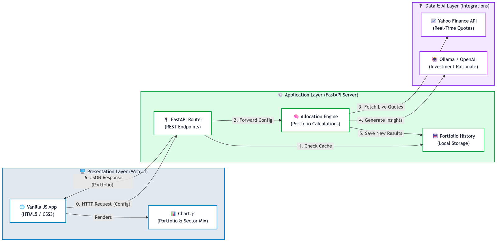

# InvestIQ — Stock Portfolio Suggestion Engine

**InvestIQ** is a Python-based application that generates stock portfolio recommendations using real-time market data and various investment strategies.

[**Live UI Demo**](https://jack-200.github.io/cmpe-285-stock-portfolio-engine/)  
_(Note: This is a static UI preview. Real-time data fetching and portfolio generation require running the backend locally.)_

## 📖 Table of Contents

- [👥 Team Members](#team-members)
- [⚡ Features](#features)
- [🛠️ Tech Stack](#tech-stack)
- [🚀 Getting Started](#getting-started)

## 👥 Team Members

- **Jack Liang** ([jack.liang@sjsu.edu](mailto:jack.liang@sjsu.edu))
- **Jiajian Liu** ([jiajian.liu@sjsu.edu](mailto:jiajian.liu@sjsu.edu))
- **Jeffrey Gu** ([jeffrey.gu@sjsu.edu](mailto:jeffrey.gu@sjsu.edu))
- **Sean Patrick Konaka** ([seanpatrick.konaka@sjsu.edu](mailto:seanpatrick.konaka@sjsu.edu))

## ⚡ Features

- **Investment Strategies**: Ethical, Growth, Index, Quality, and Value investing.
- **Real-time Data**: Live stock prices and historical trends via `yfinance`.
- **Dynamic Allocation**: Automated fund distribution based on selected strategies.
- **Modern UI**: Interactive glassmorphism dashboard.

## 🛠️ Tech Stack

- **Backend**: Python (FastAPI, Uvicorn, yfinance, Pandas, Pydantic)
- **Frontend**: HTML5, CSS3, JavaScript (Chart.js)
- **Tools & Management**: uv, **`scripts/start.sh`** / **`scripts/start.ps1`** / **`scripts/setup-local-llm.sh`** / **`scripts/setup-local-llm.ps1`**, Antigravity AI, VS Code, GitHub

## 🚀 Getting Started

### Prerequisites

- 
- **Optional (AI Features):**  (local models) or any OpenAI-compatible API (e.g., Gemini API or OpenAI API) for portfolio insights & chat. See `.env.example`.

### Shell scripts

| Script | Purpose |
| --- | --- |
| `setup-local-llm.sh` | Ollama setup for Linux or macOS. |
| `setup-local-llm.ps1` | Ollama setup for Windows. Installs Ollama if needed, then pulls `LLM_MODEL`. Use `-PullOnly` to skip install. |
| `start.sh` | Startup script for Linux/macOS. |
| `start.ps1` | Startup script for Windows. |

Make scripts executable once if needed: `chmod +x scripts/setup-local-llm.sh scripts/start.sh`.

### Recommended flow

1. Copy `.env.example` to `.env` and adjust `LLM_BACKEND`, `OLLAMA_HOST`, and `LLM_MODEL`.
2. Optional: run the Ollama setup script for your OS.
3. Run the startup script for your OS, then open `http://localhost:8000`.

### Without the scripts

You can still use **`uv run -m app.main`** or create a venv manually, **`pip install -r requirements.txt`**, **`python -m app.main`**. Environment variables for the LLM are not loaded automatically unless you export them or use **`scripts/start.sh`** / your shell profile.
